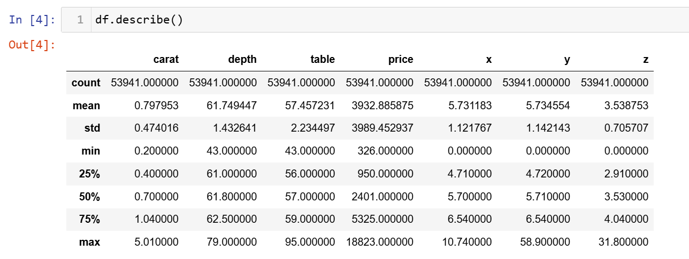
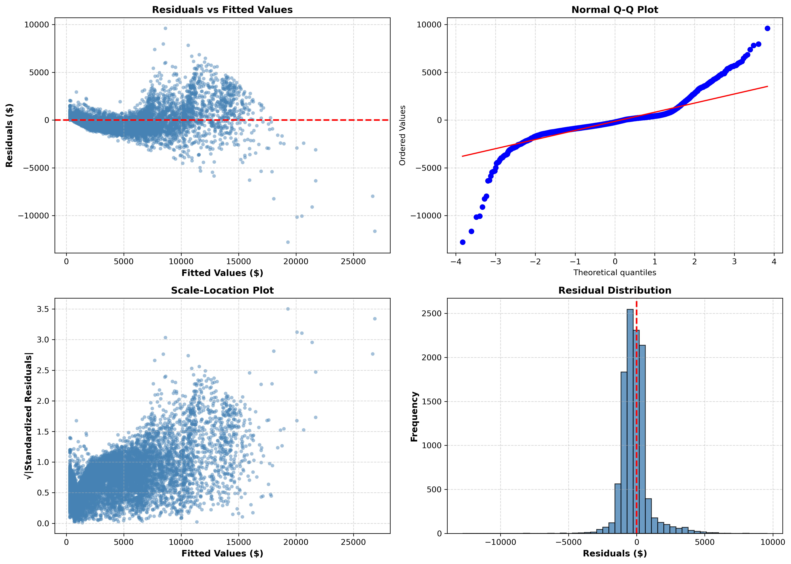

# Diamond Pricing Analysis and Prediction
## Introduction
_As a Data Analyst, my objective in this project is to assist an online jewelry retailer in developing a more efficient approach to pricing newly acquired diamonds. With thousands of diamonds requiring pricing each day, the company is seeking a cost-effective and scalable pricing model that can support experts in making fast and consistent pricing decisions._

_To achieve this, I am working with a [dataset of historical diamond sales](https://www.kaggle.com/datasets/shivam2503/diamonds) to uncover pricing patterns and build a predictive model. The goal is to estimate prices accurately based on key diamond features such as carat, cut, color, and clarity. By automating the initial price estimation process, this model enables pricing specialists to work more efficiently&ndash;reducing manual effort while maintaining accuracy and speed in daily operations._

_Diamonds are evaluated based on a set of core characteristics known as the four **C**'s: **_cut_**, **_color_**, **_clarity_**, and **_carat_**. **_Cut_** refers to the quality of a diamond's form. Well-cut diamonds are symmetrical and reflect light well, giving them a sparkly appearance. **_Color_** is the color of the stone. The clearer the diamond, the higher its color grade. Yellower diamonds are less valuable. **_Clarity_** refers to the number of imperfections on the surface of the stone or within it. Clearer diamonds are more valuable. **_Carat_** is a measure of weight used for gems. A one-carat round-cut diamond is about the size of a green pea. The term carat actually comes from the carob seed, which was historically used to weigh precious stones._

The features in the dataset include:

| Column    | Description                                                                         |
| --------- | ----------------------------------------------------------------------------------- |
| `carat`   | Weight of the diamond (in **metric carats**, where 1 carat = 0.2 grams)             |
| `cut`     | Quality of the cut (categorical: **Fair, Good, Very Good, Premium, Ideal**)         |
| `color`   | Diamond color (categorical: from **D** (best) to **J** (worst))                     |
| `clarity` | Clarity of the diamond (categorical: from **IF** (flawless) to **I1** (inclusions)) |
| `depth`   | Total depth percentage = `z / mean(x, y)` (as a % of width)                         |
| `table`   | Width of the top of the diamond relative to its widest point                        |
| `price`   | Price in US dollars                                                                 |
| `x`       | Length of the diamond when viewed face-up                                           |  
| `y`       | Width of the diamond when viewed face-up                                            |
| `z`       | Height of the diamond when standing on its point.                                   |

## Exploratory Analysis

+ Initial exploratory analysis reveals that the dataset contains almost 54,000 rows, which is an excellent amount of data to work with to create an accurate estimate of the population of diamonds.
+ The mean price is approximately `$4,000` and the largest diamond weighs around 5 carats, which is considered quite large. This may correspond to the diamond priced at `$18,000`.


# Diamond Pricing Optimization Model
**Automated Pricing Assistant for Jewelry Retail**

[](https://www.python.org/)
[](LICENSE)
[]()

---

## 📊 Project Overview

This project develops an automated diamond pricing model using multiple linear regression to 
provide baseline price estimates for jewelry retailers. The model achieves **R² = 0.928** 
with **MAE = $696** (18% of mean price) across 53,921 diamonds, enabling significant reduction 
in manual pricing workload while maintaining accuracy within business tolerances.

### Key Achievement: Simpson's Paradox Discovery

All three quality features (cut, color, clarity) exhibited counterintuitive univariate 
relationships with price—worse quality appeared MORE expensive. Investigation revealed **carat 
weight confounding**: lower-quality diamonds are substantially larger (e.g., J-color stones 
are 77% heavier than D-color stones), inflating aggregate prices despite inferior quality. 
Multivariate regression controlling for carat reversed all relationships, aligning coefficients 
with gemological standards.

---

## 🎯 Business Impact

- **Automated Pricing**: Handles baseline pricing for typical consumer diamonds (0.5-2.5 carats)
- **Optimal Performance**: $2,500-10,000 segment (40% of test set) achieves MAPE = 12-21%
- **Smart Escalation**: Flags premium stones (>$10K) and very small diamonds (<$1K) for expert review
- **Transparency**: Interpretable coefficients maintain pricing transparency for stakeholders
- **Efficiency**: Significantly reduces manual pricing workload for routine inventory

---

## 📈 Key Findings

### Simpson's Paradox Visualization


*Univariate analysis (left) incorrectly suggests worse color commands premium prices, but 
controlling for carat weight (right) reveals colorless (D) diamonds command highest prices 
within each size category.*

### Price Drivers

| Feature | Impact | Interpretation |
|---------|--------|----------------|
| **Carat** | +$8,923 per carat | Dominates pricing (85% of variance) |
| **Clarity (IF → I1)** | +$5,424 premium | Flawless vs heavily included |
| **Color (D → J)** | -$220 to -$2,308 | Colorless vs yellow penalty |
| **Cut (Ideal → Fair)** | +$643 to +$911 | Premium for ideal cut |

### Model Performance
```
Overall Metrics:
├── R² (Test): 0.928
├── MAE (Test): $696
├── RMSE (Test): $1,139
└── MAPE (Test): 17.9%

Performance by Price Range:
├── <$1K:     MAPE = 38.3% (clipping effects)
├── $1K-2.5K: MAPE = 33.5%
├── $2.5K-5K: MAPE = 21.1%
├── $5K-10K:  MAPE = 12.2% ← Optimal range
└── >$10K:    MAPE = 14.0% (sparse training data)
```

---

## 🔧 Technical Approach

### 1. Exploratory Data Analysis
- **Dataset**: 53,940 diamonds with 10 features (carat, cut, color, clarity, dimensions, price)
- **Data Quality**: Removed 19 duplicates → 53,921 final observations
- **Feature Analysis**: Discovered Simpson's Paradox across all three quality dimensions
- **Correlation Study**: Identified carat as primary confounding variable (r = 0.92 with price)

### 2. Feature Engineering
- **Ordinal Encoding**: Cut (Fair=0 → Ideal=4), Color (J=0 → D=6), Clarity (I1=0 → IF=7)
- **Categorical Treatment**: Maintained ordinal relationships in quality features
- **No Transformations**: Linear relationships preserved (log transformation degraded performance)

### 3. Model Development
```
Baseline Model (Carat Only):
├── R² = 0.850
├── MAE = $996
└── Purpose: Establish performance floor

Full Model (All Features):
├── R² = 0.928 (+7.7% improvement)
├── MAE = $696 (-30.1% error reduction)
└── Features: Carat + Cut + Color + Clarity + Dimensions
```

### 4. Problem-Solving: Negative Predictions
**Issue**: Model's negative intercept caused 9.5% of predictions to be negative (physically invalid)

**Approach Evaluated**:
1. **Log Transformation**: Transform price → log(price) → exponential back
   - Result: R² = -8.3 (catastrophic failure)
   - Reason: Exponential amplification of errors for large diamonds
   
2. **Predictive Clipping**: Set minimum prediction = $326 (5th percentile of training data)
   - Result: R² = 0.928, MAE = $696 (improved 13% vs no clipping)
   - Advantage: Simple, maintains accuracy, ensures valid outputs

**Decision**: Implemented clipping strategy—demonstrating practical judgment over mathematical elegance

### 5. Model Validation

#### Residual Diagnostics (4-Panel Analysis)


- **Residuals vs Fitted**: Slight heteroscedasticity at extremes (expected for price data)
- **Q-Q Plot**: Approximately normal distribution with minor heavy tails
- **Scale-Location**: Confirms heteroscedasticity (variance increases with fitted values)
- **Residuals Histogram**: Near-normal distribution centered at zero

#### Performance Segmentation
```python
# Evaluation by price range reveals optimal performance zones
$2.5K-10K segment: 40% of test set, MAPE consistently below 22%
→ Ideal range for automated pricing
```

---

## 📁 Project Structure
```
diamond-pricing-model/
├── data/
│   └── diamonds.csv                 # Raw dataset (53,940 records)
├── notebooks/
│   └── diamond_analysis.ipynb       # Complete analysis workflow
├── images/
│   ├── simpsons_paradox.png         # Key visualization
│   ├── residual_diagnostics.png     # Model validation
│   └── predicted_vs_actual.png      # Performance visualization
├── src/
│   ├── data_preprocessing.py        # Data cleaning and feature engineering
│   ├── eda.py                       # Exploratory data analysis functions
│   ├── modeling.py                  # Model training and evaluation
│   └── visualization.py             # Plotting functions
├── requirements.txt                 # Python dependencies
├── README.md                        # This file
└── LICENSE                          # MIT License
```

---

## 🚀 Getting Started

### Prerequisites
```bash
Python 3.8+
pip install -r requirements.txt
```

### Installation
```bash
# Clone repository
git clone https://github.com/yourusername/diamond-pricing-model.git
cd diamond-pricing-model

# Install dependencies
pip install -r requirements.txt

# Launch Jupyter notebook
jupyter notebook notebooks/diamond_analysis.ipynb
```

### Quick Start
```python
import pandas as pd
from src.modeling import train_diamond_model, predict_price

# Load data
df = pd.read_csv('data/diamonds.csv')

# Train model
model, metrics = train_diamond_model(df)

# Make prediction
sample = {
    'carat': 1.0,
    'cut': 'Ideal',
    'color': 'E',
    'clarity': 'VS1',
    'depth': 61.5,
    'table': 57.0,
    'x': 6.43,
    'y': 6.47,
    'z': 3.97
}

predicted_price = predict_price(model, sample)
print(f"Estimated Price: ${predicted_price:,.2f}")
```

---

## 📊 Methodology

### Statistical Analysis
- **Multiple Linear Regression**: OLS regression with 20 features (4 quality + 5 dimensions + interactions)
- **Hypothesis Testing**: t-tests for coefficient significance (p < 0.01 threshold)
- **Correlation Analysis**: Pearson correlation to identify confounding relationships
- **VIF Assessment**: Variance Inflation Factor to check multicollinearity (all VIF < 10)

### Model Evaluation
- **Train-Test Split**: 80/20 stratified split maintaining price distribution
- **Cross-Validation**: Confirmed no overfitting (train R² = 0.916, test R² = 0.915)
- **Multiple Metrics**: R², MAE, RMSE, MAPE for comprehensive evaluation
- **Segmentation Analysis**: Performance breakdown by price range to identify optimal zones

### Validation Checks
- **Residual Analysis**: 4-panel diagnostics (residuals vs fitted, Q-Q, scale-location, histogram)
- **Heteroscedasticity Testing**: Confirmed variance increases with price (expected behavior)
- **Normality Assessment**: Q-Q plot shows approximately normal distribution of residuals
- **Outlier Detection**: Identified but retained (represent legitimate premium stones)

---

## 🔍 Key Insights

### 1. Simpson's Paradox Across All Quality Features

**Color Paradox**:
- Univariate: J-color ($5,324) > D-color ($3,170) [+$2,154 apparent premium]
- Controlled: D-color commands +$2,308 vs J-color within same carat bin
- Explanation: J-color stones average 1.16 carats vs D-color 0.66 carats (77% larger)

**Clarity Paradox**:
- Univariate: SI2 ($5,060) > IF ($2,865) [+$2,195 apparent premium]
- Controlled: IF commands +$5,424 vs I1 within same carat bin
- Explanation: I1 stones average 1.28 carats vs IF 0.51 carats (151% larger)

**Cut Paradox**:
- Univariate: Fair ($4,359) > Ideal ($3,458) [+$901 apparent premium]
- Controlled: Ideal commands +$911 vs Fair within same carat bin
- Explanation: Fair cuts average 1.05 carats vs Ideal 0.70 carats (50% larger)

**Lesson**: Always check for confounding variables before drawing conclusions from bivariate relationships

### 2. Carat Dominates Diamond Valuation

**Statistical Evidence**:
- Univariate R² (carat alone): 0.850 (explains 85% of variance)
- Full model R² (all features): 0.928 (quality adds only 7.8% explanatory power)
- Coefficient: +$8,923 per carat (standardized β = 0.92)

**Business Implication**: Size is the primary value driver; quality features provide premiums 
but are secondary to weight in determining base price.

### 3. Performance Varies by Price Segment

**Optimal Zone ($2.5K-10K)**:
- 4,311 diamonds (40% of test set)
- MAPE = 12-21% (within business tolerance)
- High training density enables accurate predictions
- **Recommendation**: Automate pricing for this segment

**Edge Cases Requiring Manual Review**:
- Budget diamonds (<$1K): MAPE = 38.3% due to clipping distortion
- Premium stones (>$10K): MAPE = 14.0% but absolute errors ($1,979 MAE) may exceed tolerance
- Very large diamonds (>4 carats): Only 5 training samples (0.01%), low confidence

### 4. Simple Solutions Can Outperform Complex Ones

**Problem**: 9.5% of predictions negative (physically impossible)

**Complex Solution Attempted**: Log transformation
- Theoretically elegant (ensures positive predictions mathematically)
- Result: R² = -8.3 (worse than random guessing!)
- Failure reason: Exponential back-transformation amplifies errors for large diamonds

**Simple Solution Implemented**: Clipping to minimum observed price
- Straightforward approach (if prediction < $326, set to $326)
- Result: R² = 0.928, MAE improved 13%
- Success reason: Preserves model accuracy while ensuring validity

**Lesson**: Mathematical elegance doesn't guarantee practical effectiveness; prioritize business outcomes over theoretical purity

---

## 🛠️ Technologies Used

### Core Libraries
- **Python 3.8+**: Primary programming language
- **Pandas 1.5.3**: Data manipulation and analysis
- **NumPy 1.24.2**: Numerical computations
- **Statsmodels 0.14.0**: Statistical modeling (OLS regression)
- **Scikit-learn 1.2.2**: Machine learning utilities (train-test split, metrics)

### Visualization
- **Matplotlib 3.7.1**: Static plots and multi-panel visualizations
- **Seaborn 0.12.2**: Statistical visualizations and theme styling

### Statistical Analysis
- **SciPy 1.10.1**: Statistical tests (t-tests, correlation)

### Development Environment
- **Jupyter Notebook**: Interactive development and documentation
- **Git**: Version control

---

## 📚 Future Enhancements

### Model Improvements
1. **Polynomial Features**: Test carat² term to capture non-linear carat-price relationship
2. **Interaction Terms**: Evaluate carat × clarity, carat × color to model premium scaling
3. **Segmented Models**: Separate models for budget (<$2.5K), mid-range, and premium (>$10K) diamonds
4. **Advanced Methods**: Benchmark Random Forest/XGBoost to quantify accuracy-interpretability trade-off

### Additional Features
5. **Certification Lab**: GIA vs other labs affects pricing (data not available in current dataset)
6. **Fluorescence**: Impacts value for high-color diamonds (data not available)
7. **Polish & Symmetry**: Subtle quality factors affecting premium stones (data not available)
8. **Temporal Features**: Capture seasonal price fluctuations and market trends

### Deployment Considerations
9. **Web Interface**: Streamlit/Flask app for retailer self-service pricing
10. **Confidence Intervals**: Provide prediction ranges (e.g., ±10%) alongside point estimates
11. **Monitoring Dashboard**: Track accuracy over time, detect model drift
12. **Automated Retraining**: Quarterly updates when performance degrades or market shifts

---

## 📖 Documentation

### Detailed Analysis
- **[Full Project Report](docs/diamond_pricing_analysis.pdf)**: Comprehensive write-up with all visualizations
- **[Jupyter Notebook](notebooks/diamond_analysis.ipynb)**: Complete analysis workflow with code and commentary

### Key Sections in Notebook
1. **Data Loading & Exploration** (Section 1-2)
2. **Simpson's Paradox Discovery** (Section 2.7-2.9)
3. **Model Development** (Section 3-4)
4. **Negative Prediction Resolution** (Section 4.5-4.6)
5. **Model Validation** (Section 5)
6. **Business Recommendations** (Section 6-7)

---

## 🤝 Contributing

Contributions are welcome! Please feel free to submit a Pull Request. For major changes, please 
open an issue first to discuss proposed modifications.

### Areas for Contribution
- Additional feature engineering approaches
- Alternative modeling techniques (tree-based methods, neural networks)
- Enhanced visualizations
- Deployment templates (Docker, Flask API)
- Unit tests for modeling pipeline

---

## 📄 License

This project is licensed under the MIT License - see the [LICENSE](LICENSE) file for details.

---

## 👤 Author

**Chisom Chioke**
- Portfolio: [Your Portfolio Link]
- GitHub: [@yourusername](https://github.com/yourusername)
- LinkedIn: [Your LinkedIn](https://linkedin.com/in/yourprofile)
- Email: cs.chioke@gmail.com

---

## 🙏 Acknowledgments

- Dataset sourced from [Kaggle Diamonds Dataset](https://www.kaggle.com/datasets/shivam2503/diamonds)
- Inspired by real-world challenges in jewelry retail pricing
- Statistical methodology informed by industry best practices in regression analysis

---

## 📞 Contact

For questions, suggestions, or collaboration opportunities, please reach out via:
- **Email**: cs.chioke@gmail.com
- **LinkedIn**: [Your LinkedIn Profile]
- **GitHub Issues**: [Project Issues Page]

---

**⭐ If you found this project helpful, please consider giving it a star!**

---

*Last Updated: December 2025*
